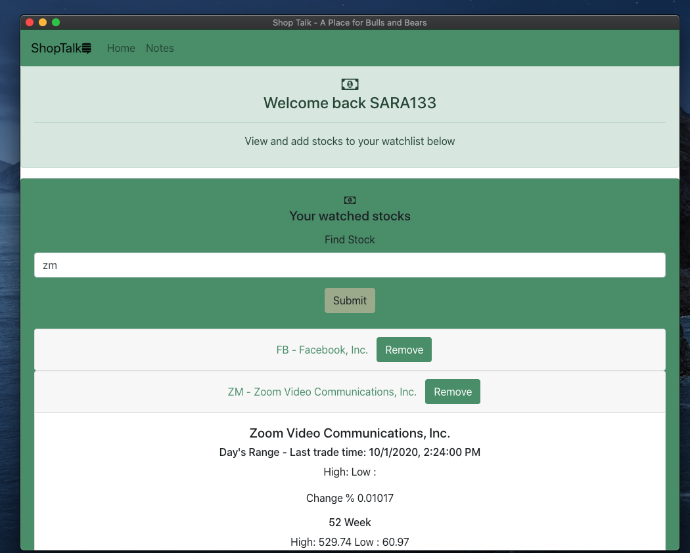

## ShopTalk

Shoptalk is an Electron App allows users to track their selected stocks with data coming from the IEX Cloud API. This application was build as part of FullStack Academy Coding Bootcamp over the course of 4 days.

### Core technologies:

- Electron
- React (Leveraging Create React App)
- React Bootstrap
- Redux
- Express
- Node.js/JS
- SQLite

### To start :

#### npm run start to start localhost:3000 
#### node server/app.js to start server on localhost:8080
#### npm run electron-start to the Electron App

